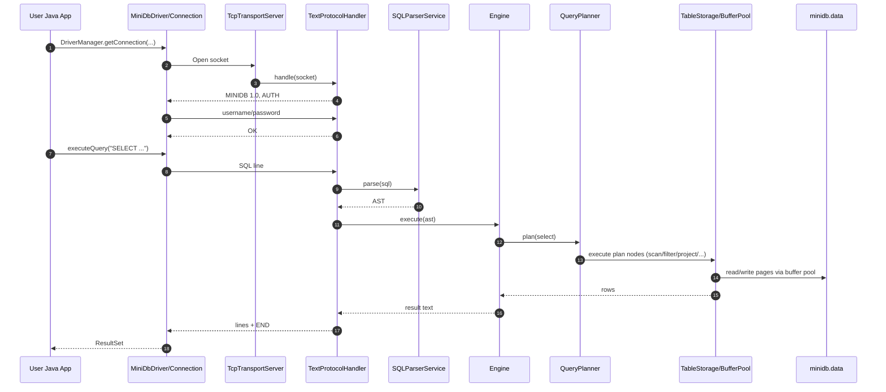
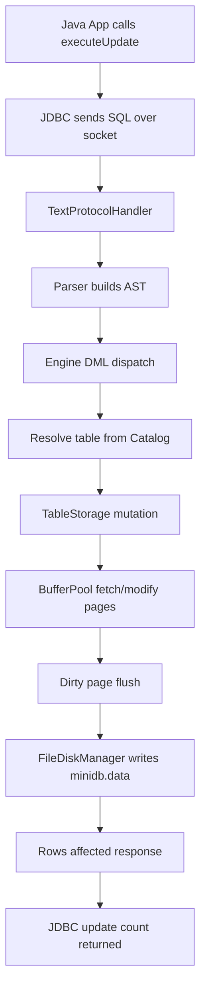
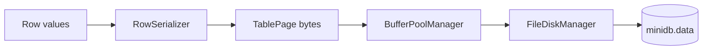
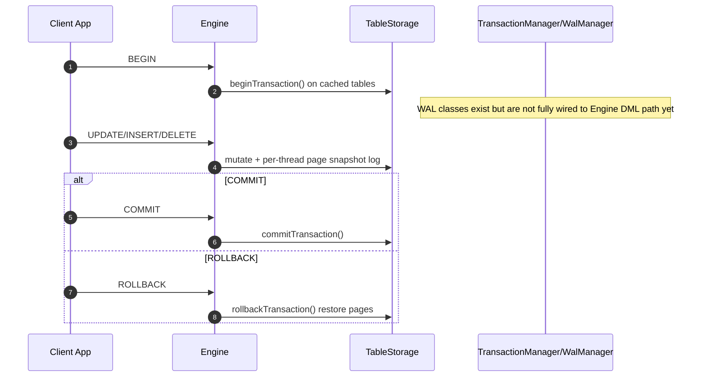
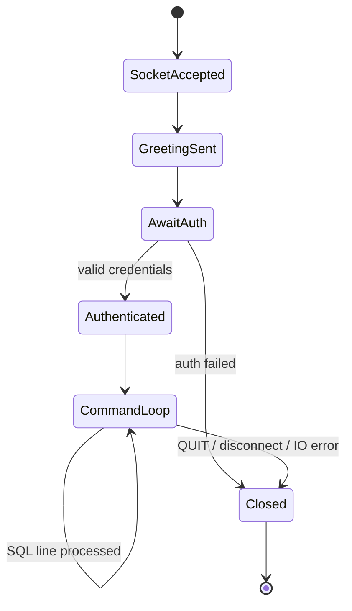
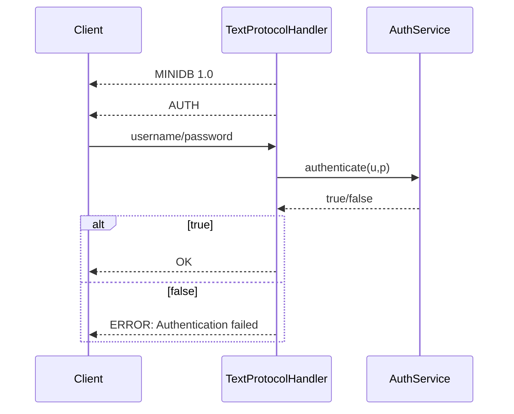

# MiniDatabase Flow and Visualization Guide

This document provides implementation-aligned flow explanations and visualization options.

## 1. End-to-end connection and query flow



## 2. Write path (INSERT/UPDATE/DELETE)



## 3. Data persistence flow



Catalog metadata is stored separately in `data/catalog.meta`.

## 4. Transaction flow (current code behavior)



## 5. Session and connection lifecycle



## 6. Indexing flow (current scaffold)

```mermaid
flowchart TD
    A[IndexManager.createIndex(table,col)] --> B[BPlusTree allocated in memory]
    B --> C[insertEntry/lookup/rangeLookup APIs]
    C --> D[Query/runtime integration pending]
```

Status:
- In-memory index APIs are implemented.
- Planner index selection and transactional index maintenance are still pending.

## 7. Authentication and security flow



Current security posture:
- Basic authentication exists.
- No authorization (roles/grants) yet.
- No TLS transport encryption yet.

## 8. Can we add visualization to our database?

Yes. You can add both operational and data-model visualization in phases.

### 8.1 Immediate options (no major code changes)
1. Mermaid docs (already enabled in these docs) for architecture and runtime flows.
2. Graphviz generation from catalog metadata (`db.schema.table -> columns`).
3. SQL trace timeline export (CSV/JSON) from protocol/executor logs.

### 8.2 Recommended implementation plan
1. Add `minidb-observability` module.
2. Introduce event stream interfaces:
   - connection events
   - statement lifecycle events
   - page read/write events
   - transaction events
3. Persist events to JSON log.
4. Build simple web UI (or desktop JavaFX) to visualize:
   - active sessions
   - query latency
   - hot pages
   - table and index topology

### 8.3 Suggested first visualization dashboard
- Connections: active, authenticated, failed auth count.
- Queries: per-statement counts and p95 latency.
- Storage: page read/write counters, dirty flushes.
- Transactions: begin/commit/rollback counts.

## 9. Suggested developer command set

```powershell
Set-Location "D:\projects\MiniDatabase"
mvn clean install -DskipTests --no-transfer-progress
mvn test --no-transfer-progress
```

Start server:

```powershell
Set-Location "D:\projects\MiniDatabase"
mvn -pl minidb-server -am exec:java -Dexec.mainClass="com.minidb.server.DatabaseServer"
```

Start client:

```powershell
Set-Location "D:\projects\MiniDatabase"
mvn -pl minidb-client -am exec:java -Dexec.mainClass="com.minidb.client.MiniDbClient"
```

